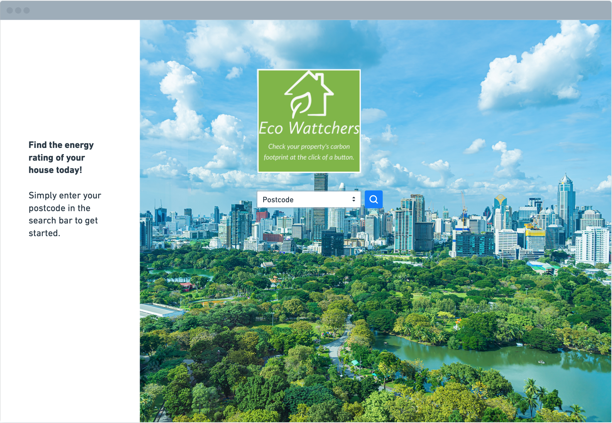
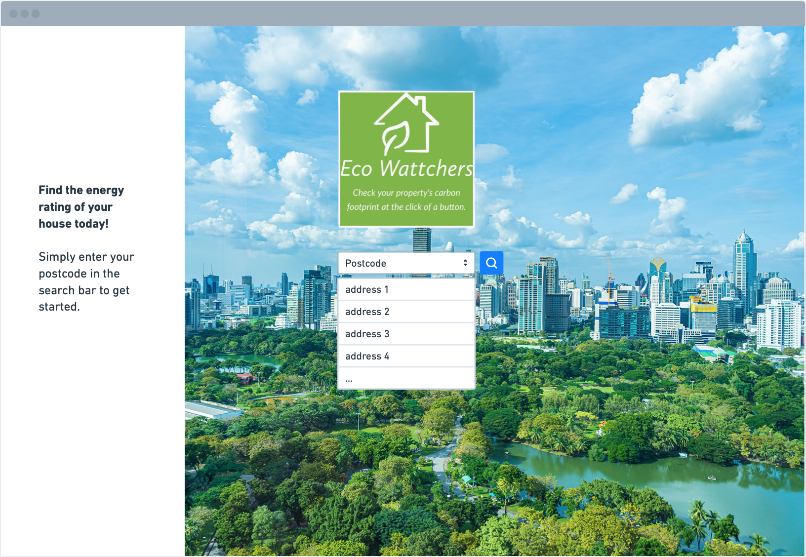
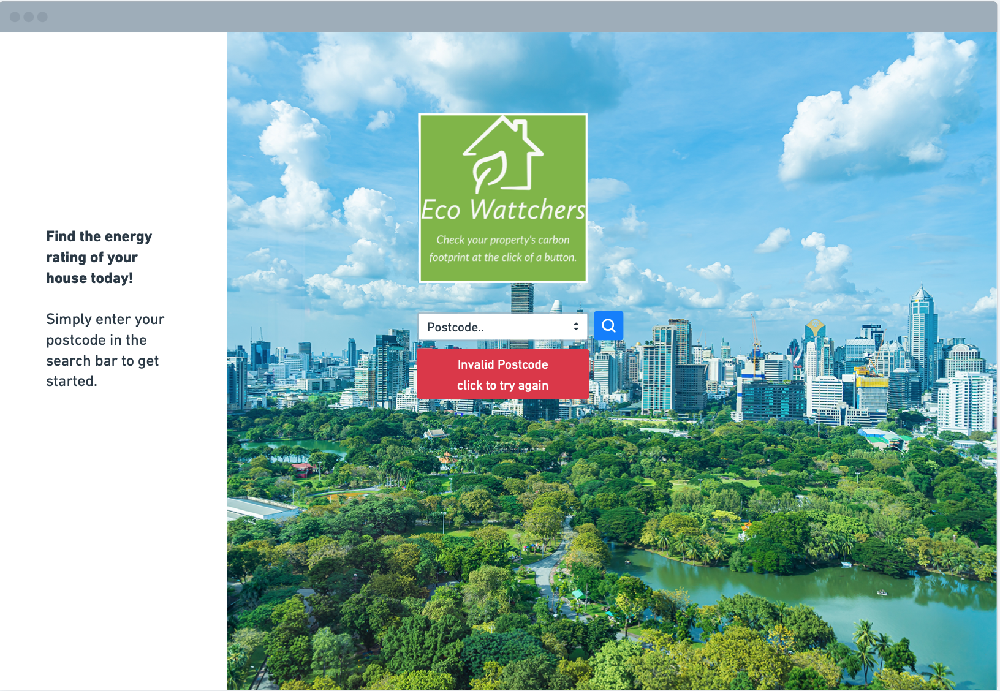
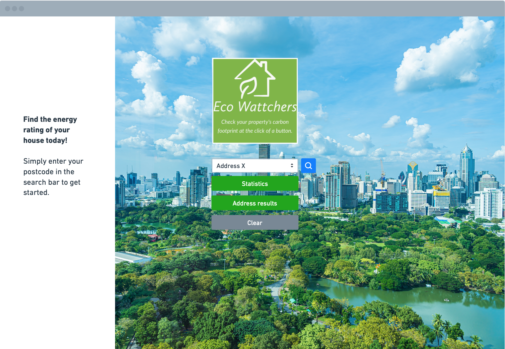
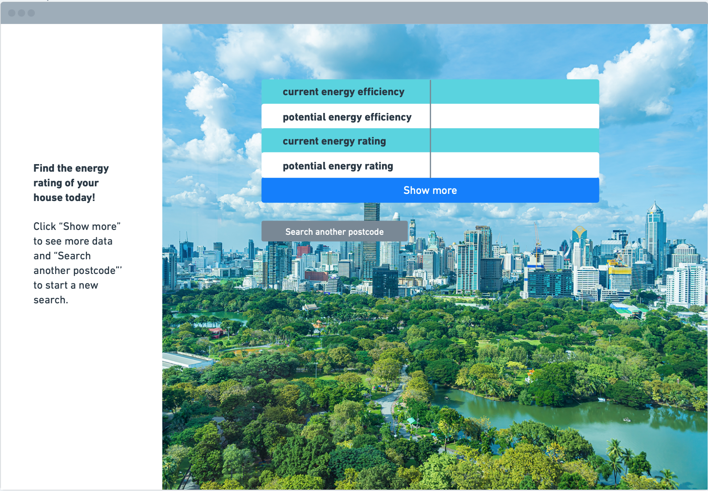

# ecolookuptool

A web app that looks up the energy performance of a property given it's address then sends the user to a website for more information

## Steps

### 1. User inputs their postcode into a form and clicks the search button

### 2. All corresponding addresses appear as a drop-down box

### 2.5 If you search an invalid address you can click on the red button to search for another one

### 3. User selects their address from the list and clicks "Statistics"

### 4. The formated address is sent to the EPC API and returns the most up to date information about their property

### 5. You can click on the "Show more" button to see all the informations

## References

### GetAddress API endpoint: https://api.getAddress.io/find/{postcode}?api-key={apiKey}

### GetAddress API documentation: https://documentation.getaddress.io

### Domestic EPC search API endpoint: https://epc.opendatacommunities.org/api/v1/domestic/search?address=

### Domestic EPC search API documentation: https://epc.opendatacommunities.org/docs/api/domestic

