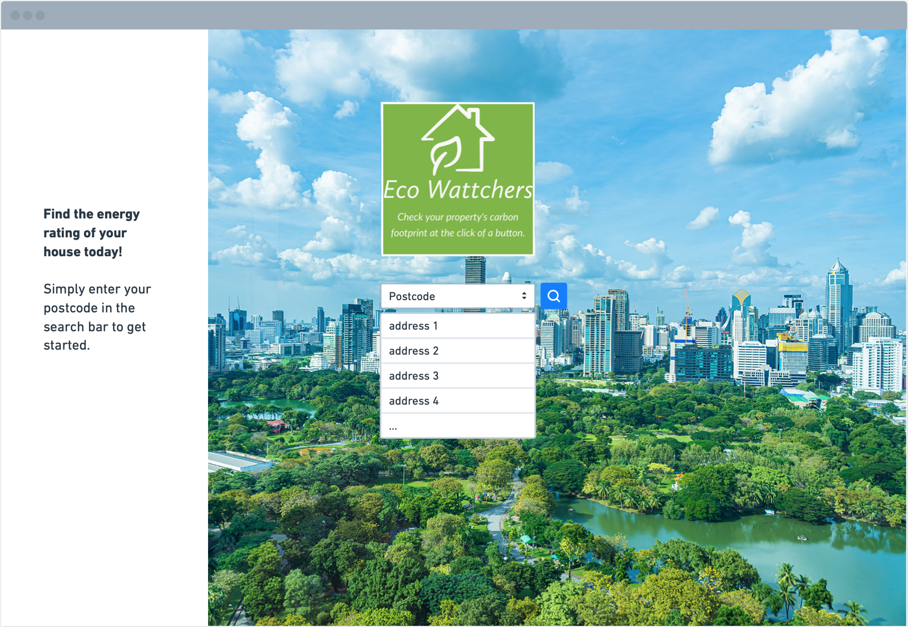
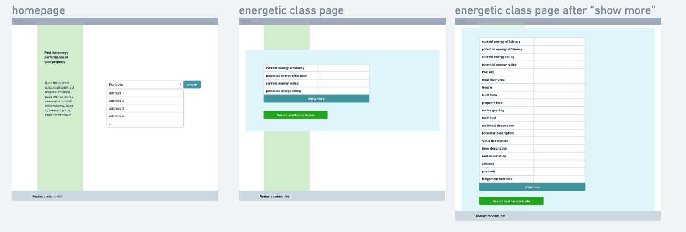
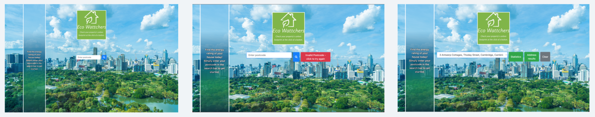
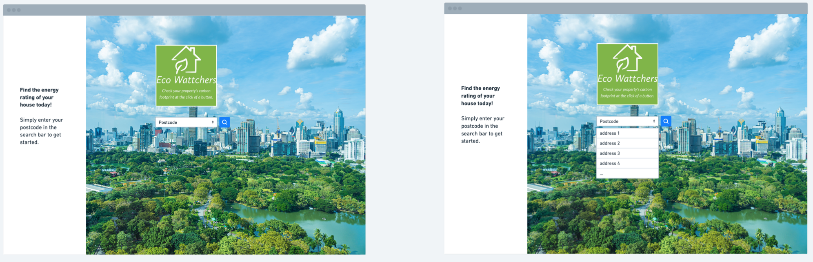

# THE ECO-LOOKUP WEB APPLICATION (EPC)  <image src="https://img.shields.io/badge/license-MIT-green/size=100"> #

## Table of Contents ##

> [The Scope of the Project](#project-scope)

> [What is the EPC web application?](#what-it-is)

> [How does it work?](#how-it-works)

> [How to use](#how-to-use)

> [UX/UI design](#the-app-design)

> [Wireframes](#wireframes)

> [Project requirements](#project-requirements)

> [References](#references)

## The Scope of The Project ##

This repo forms the submission materials and deployment of the first of two group projects that count towards the formal grades received from completion of the front-end web development bootcamp. The product has been developed to satisfy the [Requirements](#project-requirements)  at the end of the article

## What is the EPC web Application?

This easy to use EPC web app is built on top of the opendatacommunities Domestic Energy Performance certificate API. The application itself is built using Javascript for easy 
integration into a webpage, much like the opendatacommunities one. The application leverages
the postcodefinder.io address lookup API which makes it as easy as  typing a UK postcode, choosing your address from the dropdown menu then click for your results. It's at this point you can save or print. 

**Note:** In no way is this tool affiliated with opendatacommunities

## What does the EPC Web Application do exactly? ##

> This application is designed to be a responsive, simple user interface that allows anybody to look up their Energy Performance Certificate data (EPC).

> The application does this in several stages. First we will outline the user story and then we can demonstrate that the acceptence criteria have been met for the intended use

## User story

> As a user I want to be able to look up energy performance data on my home 

> As a user I want to be able to find my full address quickly using only my postcode 

> As a user I want to be shown a drop down list of all addresses corresponding to the postcode I type in to the find address box

> As a user, when I select my address from the drop-down list my address goes into the search box

> As a user when I click on the search button the results relating to my home are shown in the browser

> As a user I want the results to be displayed concisely and with consistent formatting

 

## Project Requirements and other references ##

 

### Grading - Technical Acceptance Criteria: 25% ###
- Satisfies the following code requirements:
- Application uses at least two [server-side APIs](https://coding-boot-camp.github.io/full-stack/apis/api-resources)
- Application uses client-side storage to store persistent data.
- Application doesn't use JS alerts, prompts, or confirms (uses modals instead).
- Application uses Bootstrap.
- Application is interactive (accepts and responds to user input)

#### Concept 10% ####
- Application should be a unique and novel idea.
- Your group should clearly and concisely articulate your project idea.

#### Deployment: 20%
- Application deployed at live URL and loads with no errors.
- Application GitHub URL submitted.

#### Repository Quality: 10%
- Repository has a unique name.
- Repository follows best practices for file structure and naming conventions.
- Repository follows best practices for class/id naming conventions, indentation, quality comments, etc.
- Repository contains multiple descriptive commit messages.
- Repository contains a quality README file with description, screenshot, and link to deployed application.

#### Application Quality: 15%
- Application user experience is intuitive and easy to navigate.
- Application user interface style is clean and polished.
- Application is responsive.

#### Presentation 10%
- Your group should present using Powerpoint or a similar presentation software.
- Every group member should speak during the presentation.
- Your presentation should follow the [Project Presentation Template](https://docs.google.com/presentation/d/10QaO9KH8HtUXj__81ve0SZcpO5DbMbqqQr4iPpbwKks/edit?usp=sharing).

#### Collaboration 10%
- There are no major disparities in the number of GitHub contributions between group members.

### How to Submit Your Interactive Front-End Project
- **Each member of your group** is required to submit the following for review:
- TIhe URL of the deployed application.
- The URL of the GitHub repository, with a unique name and a README describing the project.

### Presentation Requirements

- Elevator pitch: a one minute description of your application
- Concept: What is your user story? What was your motivation for development?
- Process: What were the technologies used? How were tasks and roles broken down and assigned? What challenges did you encounter? What were your successes?
- Demo: Show your stuff!
- Directions for Future Development
- Links to the deployed application and the GitHub repository

 

 - - - - -

## Licence

Unless stated otherwise, the codebase is released under [the MIT License][mit].
This covers both the codebase and any sample code in the documentation.

 - - - - - - -

## How to use ##

### 1. User inputs their postcode into a form and clicks the search button

### 2. All corresponding addresses appear as a drop-down box

### 2.5 If you search an invalid address you can click on the red button to search for another one

### 3. User selects their address from the list and clicks "Statistics"

### 4. The formated address is sent to the EPC API and returns the most up to date information about their property, click on the "Show more" button to see all the informations

## Resources:
[Bootstrap](https://www.npmjs.com/package/bootstrap) | [GetAddress API documentation](https://documentation.getaddress.io) | [Domestic EPC search API documentation](https://epc.opendatacommunities.org/docs/api/domestic)

## Wireframes

### First Concept:

### Second Concept:

### Third Concept:

